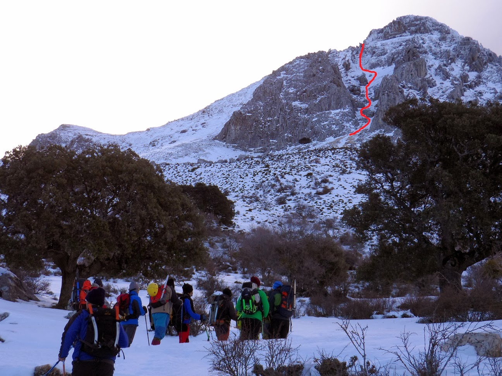
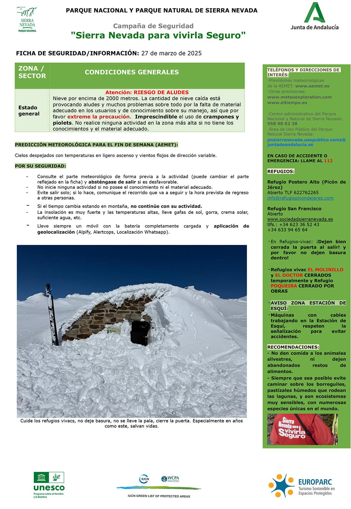

# AlpinismoHoy
Exposición del problema existente en relación a la falta de información detallada sobre las condiciones naturales en montaña, concretamente en la provincia de Jaén, en Sierra Magina, en Peña Jaén.

## Problema a resolver

España es un país montañoso, que cuenta con multitud de lugares a lo largo y ancho de su geografía que son idoneos para la práctica de deportes de montaña, como pueden ser el senderismo, _parachuting_, alpinismo, ski o _mountain bike_ entre otros.

Cada uno de estos deportes requiere de una serie de condiciones naturales especificas que se deben dar para hacer posible su práctica. Concretamente Jaén, es una de las provincias que mas montañas y entornos naturales tiene del sur de la peninsula, pero es una gran desconocida, lo que imposibilita muchas veces llegar a conocer o organizar un viaje o una escapada.

El problema concreto se da en el "canuto de peña Jaén", una escarpada pendiente de hielo y roca que se usa para acceder a la montaña homónima. Se carece de un boletín de información detallado que permita conocer las condiciones del momento para planear una ruta.

El boletín que se precisaría sería algo parecido a lo siguiente:

## ¿Por que me implica personalmente?
Soy y siempre he sido un gran aficionado a todo tipo de deportes de montaña y siempre los he prácticado habiendome topado con el problema que el cliente describe a cerca de ellos en numerosas ocasiones e implicandome por tanto personalmente en la resolución del mismo.

## ¿Cómo se obtienen los datos?
Para la obtención de los datos, trataremos de construir una representación del estado de la montaña a partir de los datos meteorológicos actuales y pasados obtenidos periodicamente de estaciones cercanas a la montaña, cobertura de nieve, historico de precipitación y reportes humanos.

He reunido las siguientes fuentes:

- [AEMET](https://opendata.aemet.es/opendata/sh/a7ef04e2) -> Mediante la API _OpenData_ de _AEMET_ se pueden obtener datos meteorológicos de los muicipios mas cercanos y estaciones de manera periódica, estos son los datos de Torres, el municipio que más nos interesa.

- [Copernicus](https://land.copernicus.eu/en/products/snow/snow-cover-extent-europe-v1-0-500m) -> [Fotografía](media/sierra_nevada_26_06.png) de alta resolución por satelite de Copernicus de la capa de nieve y [API estadística.](https://documentation.dataspace.copernicus.eu/APIs/SentinelHub/Statistical.html)

- [IGN / CING](https://centrodedescargas.cnig.es/CentroDescargas/buscar-mapa) -> Para obtener mapa con elevada resolución de la zona.

- [Junta de Andalucía](https://www.juntadeandalucia.es/medioambiente/portal/web/ventanadelvisitante/detalle-buscador-mapa/-/asset_publisher/Jlbxh2qB3NwR/content/subida-a-pico-m%C3%A1gina-y-miramundos) -> Aqui se obtiene una versión en GML de las posibles rutas.

- [Wikiloc](https://es.wikiloc.com/rutas-senderismo/mata-bejid-torres-18668294) -> Scrapping para en caso de haber rutas recientes, obtener información adicional de rutas realizadas por personas.

## ¿Donde está la logica de negocio?
Se plantea realizar una ficha de seguridad especifica para Peña Jaén, que detalle a partir de los datos obtenidos de estaciones cercanas, las temperaturas y condiciones esperadas. Se realizarian calculos a partir de los datos de temperatura y humedad para obtener las condiciones de temperatura y humedad arriba en la montaña, y se añadirá la última foto disponible de satelite junto con una descripción del posible estado de la nieve en base a las condiciones de los últimos dias. De manera adicional, en caso de existir, se añadiran reportes recientes de personas reales que hicieron la ruta.

## Configuración adicional
Puede verse en detalle la configuración adicional de este proyecto en: [Ver detalles de configuración](configuracion.md)