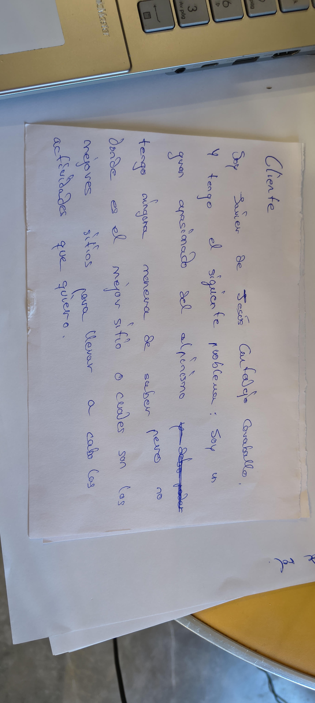

# AlpinismoHoy
Desarrollo de una solución informática para dar respuesta a la falta de información actualizada sobre las condiciones del medio natural en cordilleras españolas.

## Problema a resolver

España es un país montañoso, que cuenta con multitud de lugares a lo largo y ancho de su geografía que son idoneos para la práctica de deportes de montaña, como pueden ser el senderismo, _parachuting_, alpinismo, ski o _mountain bike_ entre otros.

Cada uno de estos deportes requiere de una serie de condiciones naturales especificas que se deben dar para hacer posible su práctica. Sin embargo, hoy en dia es dificil conocer a donde deberiamos ir para encontrar lo que buscamos.

Concretamente en el alpinismo, existe el problema de que muchas veces se dan situaciones comprometidas en la montaña en las que una persona se halla haciendo una ruta y se encuntra con condiciones adversas que le impiden progresar adecuadamente o que lo ponen en una situacion de riesgo debido a que no se ha elegido bien el destino, ya que no se ha podido acceder a suficiente información sobre el sitio al que se fué.

Dichas situaciones adversas o simplemente no deseadas mencionadas, no se reducen simplemente al tiempo atmosférico que se pueda dar en ese momento, si no también a las influencias que lo acontecido en dias anteriores puede tener. Por ejemplo, malas condiciones de la nieve, causando desprendimientos, abalanchas o riadas, poca nieve en zonas donde se esperaba, dando lugar a requerir un equipamiento diferente, o demasiada nieve, provocando las mismas consecuencias. No existe, por mucha organización que se tenga, una manera de saber, para sitios concretos como van a ser las condiciones sin volverse loco buscando (A menos que se trate de un lugar muy famoso como algunas zonas de sierra Nevada o los Pirineos).

Por ejemplo, un sitio donde yo he vivido este problema es Sierra Magina, en el sur de Jaén. Pese a presentar condiciones que la situan como un lugar adecuado para realizar actividades de alta montaña, no se dispone de una fuente de información detallada del estado de la montaña como si ocurre en el caso de Sierra Nevada, a la hora de realizar una expedición invernal como podría ser el canuto de peña Jaén no es posible saber el estado en que se encontrará el manto nivoso o siquiera si lo habrá, por tanto surge el problema de no saber si se va a poder realizar o no la actividad que tenemos en mente. Esta situación se repite con muchas de las montañas de características similares de Andalucía, como La Sagra en la Sierra de la Sagra, la sierra de Castril o La Maroma, en Málaga.

## ¿Por que me implica personalmente?
Soy y siempre he sido un gran aficionado a todo tipo de deportes de montaña y siempre los he prácticado habiendome topado con el problema que el cliente describe a cerca de ellos en numerosas ocasiones e implicandome por tanto personalmente en la resolución del mismo.

## ¿Cómo se obtienen los datos?
Para la obtención de los datos, trataremos de construir una representación del estado de la montaña a partir de la previsión meteorológica, estaciones cercanas a la montaña, cobertura de nieve, nivel de agua de arroyos, pendiente, historico de precipitación y reportes humanos.

He reunido las siguientes fuentes:

| Fuente | Información | Método de obtención | Uso en AlpinismoHoy |
|:---|:---|:---:|:---|
| [AEMET](https://www.aemet.es/) | Meteorología, predicciones y avisos | API | Condiciones meteorológicas |
| [Meteoexploration](https://www.meteoexploration.com/) | Predicción específica de montaña | API | Meteorología en cumbres |
| [Copernicus](https://land.copernicus.eu/) | Cobertura y evolución de la nieve | API / datos abiertos | Estado del manto nivoso |
| [SAIH Guadalquivir](https://www.chguadalquivir.es/saih/) o similares para otras cuencas. | Precipitación, caudal y niveles | Datos abiertos / API | Condiciones hidrológicas |
| [SUREMET](https://suremet.es/) | Temperatura, viento, precipitación y humedad | Scraping / datos disponibles | Observaciones meteorológicas locales |
| [IGN / CNIG](https://www.ign.es/) | Altitud, relieve, pendiente y orientación | Datos abiertos | Caracterización del terreno |
| [Junta de Andalucía](https://www.juntadeandalucia.es/) | Senderos, cartografía y espacios naturales | Datos abiertos / servicios geográficos | Información territorial |
| Nevasport | Reportes y condiciones de montaña | Web scraping | Observaciones de usuarios |
| Mendiak | Reportajes y condiciones de rutas | Web scraping | Observaciones de usuarios |

## ¿Donde está la logica de negocio?
Se proporcionan imagenes y datos reales que solucionan el problema descrito al proporcionar toda la información requerida por el usuario para elegir el lugar concreto o saber que debe llevar a la salida que se va a realizar.

## Configuración adicional
Puede verse en detalle la configuración adicional de este proyecto en: [Ver detalles de configuración](configuracion.md)