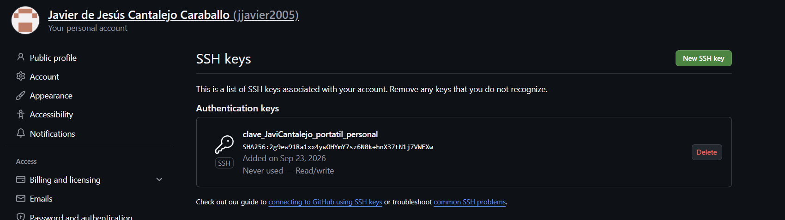
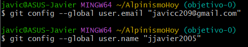

## Configuración
Para llevar a cabo la correcta configuración de git he añadido mis claves ya generadas al espacio para ello en githu (_SSH and GPG keys).

Una vez completado este paso me he conectado como jjavier2005 usando ssh mediante git bash y he configurado mi usuario:

